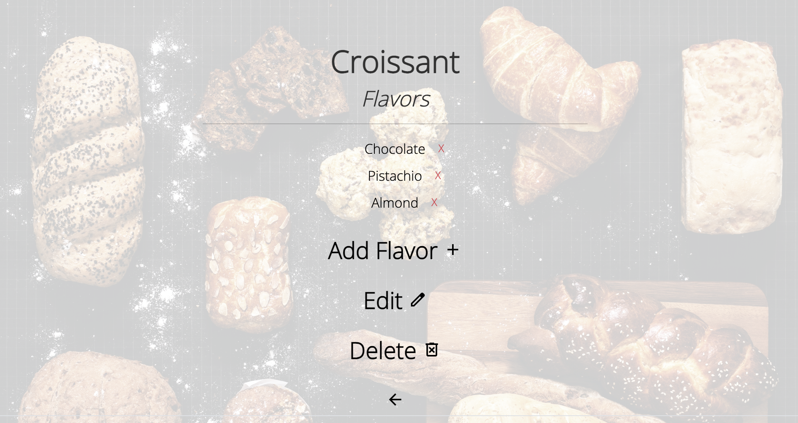

# Pierres Treats

## About
Our v2 web platform offers Pierre, the owner of Pierre's Bakery, the opportunity to create a many-to-many relationship between Treats and a variety of Flavors. Pierre can manage his website with exclusive Admin privileges while customers that Register have limited access based on what Pierre decides to delegate their Role as.

<html>

</html>

> Users will be prompted to log in if they are not.

<html>


> Once logged in, the log in prompt will be omitted.

<html>


> All users can see the Index and full Details of a Treat or Flavor but only a user assigned to an Admin Role is allowed access to Add, Create, Update, and Delete actions. Furthermore, the 'X' feature is an additional Delete button that removes a JoinEntity's relationship.

## Technologies Used
* _Github_
* _VSCode_
* _C#_
* _.NET_
* _CSHTML_
* _CSS_
* _JSON_
* _Figma_
* _Bootstrap_
* _Google Fonts API_
* _Material Symbols_
* _MySQL Workbench_

## Prerequisites

* _MySQL_
* _MySQL Workbench_
* _Entity Framework Core_

## Application Setup

1. Clone this repo.
2. Open your shell (e.g., Terminal or GitBash) and navigate to this project's production directory called `PierresTreats`. 
3. Within the production directory `PierresTreats`, create a new file entitled `appsettings.json`.
4. Within `appsettings.json`, enter the following code:
```json
{
  "ConnectionStrings": {
      "DefaultConnection": "Server=localhost;Port=3306;database={DATABASE};uid={USERNAME};pwd={PASSWORD};",
  }
}
```
  > Be sure to replace the `{DATABASE}`, `{USERNAME}` and `{PASSWORD}` fields with your own relevant information. Do not include the curly brackets.
5. In production directory, enter the following command `dotnet ef database update`. 
  > This command will initialize the repository's migrations to establish and maintain the database.
6. In the production directory, enter the following command `dotnet watch run`.
  > This command will start the project in development mode with a watcher.
7. Register for an account by visiting the following route `https://localhost:5001/account` or click on the Account icon within the navigation bar at the top of the page
8. After successful registration, click 'Redirect back to Home' to return to the Home page
9. From Home, you will see a prompt to log in as seen from the first image above, click 'log in'
10. Log into your account
11. After logging in, visit the following route `https://localhost:5001/role` or click on the Admin icon at the bottom right of the page
12. Click 'Create a Role'
13. From `https://localhost:5001/role/create`, enter `Admin` in the textbox and click 'Create'
14. You will be redirected back to `https://localhost:5001/role`, from there, click 'Assign a Role'
15. From `https://localhost:5001/role/assign`, click on the first select list '-- Select a User --' and select your account
16. From the second select list, '-- Select a Role --', select the newly created Admin role to assign your account to and click 'Assign Role'
  > Your account will now have full access to all features of this web application.

## Known Bugs

Currently no known bugs. If any issues are identified, please kindly address the issue to the owner of this repository.

## MIT License

Copyright (c) 2023 Jeremy Josol

Permission is hereby granted, free of charge, to any person obtaining a copy of this software and associated documentation files (the "Software"), to deal in the Software without restriction, including without limitation the rights to use, copy, modify, merge, publish, distribute, sublicense, and/or sell copies of the Software, and to permit persons to whom the Software is furnished to do so, subject to the following conditions:

The above copyright notice and this permission notice shall be included in all copies or substantial portions of the Software.

THE SOFTWARE IS PROVIDED "AS IS", WITHOUT WARRANTY OF ANY KIND, EXPRESS OR IMPLIED, INCLUDING BUT NOT LIMITED TO THE WARRANTIES OF MERCHANTABILITY, FITNESS FOR A PARTICULAR PURPOSE AND NONINFRINGEMENT. IN NO EVENT SHALL THE AUTHORS OR COPYRIGHT HOLDERS BE LIABLE FOR ANY CLAIM, DAMAGES OR OTHER LIABILITY, WHETHER IN AN ACTION OF CONTRACT, TORT OR OTHERWISE, ARISING FROM, OUT OF OR IN CONNECTION WITH THE SOFTWARE OR THE USE OR OTHER DEALINGS IN THE SOFTWARE.